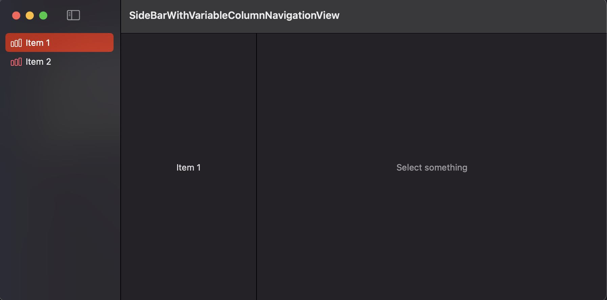

# SideBarWithVariableColumnNavigationView

This repo shows a likely bug in SwiftUI. The root navigation view does not allow
a variable number of columns to be shown, what is problematic when some items in
your sidebar have different hierarchies.

## Running Requirements

You will need Xcode 12.4 and macOS Big Sur to run this.

## Problem

### Single Hierarchy

In the code, you can look for "body01" for an example that uses a single view
hierarchy that does not reflect the links.




In the example above, when we select "Item 1", we don't want to see "Select
something", as there is nothing to be selected in the first place. Item 2 looks
good.

The code for body:

```swift
NavigationView {
    sideBar
    Text("Select a category")
        .foregroundColor(.secondary)
    Text("Select something")
        .foregroundColor(.secondary)
}
```

### Conditional Hierarchy

In the code, you can look for "body02" for an example that uses a single view
hierarchy that conditionally defines the placeholders.


In the example above, when we select "Item 2", the link to go down in the
hierarchy is disabled, which is not what we want. "Item 1" looks good.

The code for body:

```swift
NavigationView {
    sideBar
    switch selection {
    case .none:
        Text("Select on the sidebar")
    case .item1:
        Text("Nothing to select")
    case .item2:
        Text("Select a category")
            .foregroundColor(.secondary)
        Text("Select something")
            .foregroundColor(.secondary)
    }
}
```
